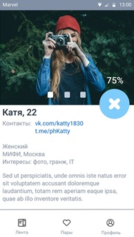

## Техническое задание. Soulmates — знакомства по интересам

**Назначение:**

Мобильное приложение для знакомств, с фильтром по интересам/увлечениям.

**Целевая аудитория:**

Все те люди, что остались недовольны форматом Tinder как сервиса для знакомств.

**Функциональность приложения:**

1. Создание нового профиля. Указываем имя, фамилию, город, интересы, etc. Небольшое текстовое поле «О себе», где можно написать всякое разное обычными словами.
2. После создания профиля – попадаем в ленту пользователей, автоматически сортированную по % совпадения интересов. Можем выставить различные фильтры для более удобного поиска. Понравившихся пользователей лайкаем, не понравившихся не лайкаем.
3. Если вдруг два юзера друг друга лайкнули – помещаем их в раздел «Пары». Отсюда можем перейти к профилю конкретного пользователя и увидеть его контакты для связи. До этого момента мы его контакты не видим.

**Описание экранов приложения:**

1. Экран авторизации

Регистрируем нового пользователя или логиним существующего.

2. Экран создания/редактирования профиля

Заполняем основную информацию (имя, город, дата рождения, контакты), отмечаем интересы.

TODO: по возможности тут надо сделать не чекбоксы, а раскрывающиеся деревья. Реализовать «вес» интересов.

3. Лента пользователей

Здесь у нас лента, ранжированная по наиболее подходящим по интересам юзерам. Из фильтров нужно реализовать как минимум:

- Возраст
- Город

4. Мэтчи

Если юзеры лайкнули друг друга – отображаем их здесь.

5. Профиль пользователя.

Сюда можно перейти из экрана мэтчей. Можно заново просмотреть всю информацию, но именно после взаимного лайка – увидеть список оставленных пользователем контактов.

**Схема переходов между экранами:**

**Разработчики:**

- Колесников Никита
- Астахов Сергей
- Вариханов Денис
- Кадыров Тимерлан